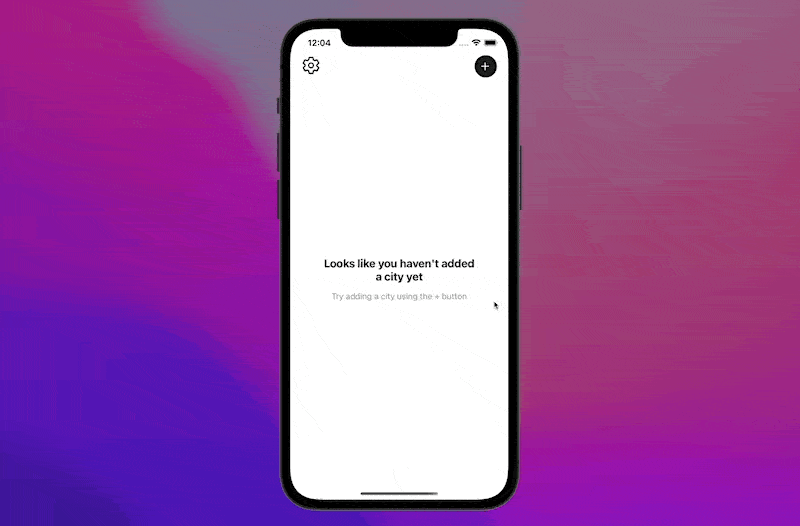

<h1 align="center">
  
</h1>

<h2 align="center">
  
</h2>

<h2 align="center">Open with Expo</h2>
<p align="center">
<a target="_blank" href="https://expo.dev/@ambegossi/simple-weather">

</a></p>
<p align="center">Install Expo client on your device and scan the QR Code</p>

## ✨ Technologies

- [React Native](https://reactnative.dev/)
- [Typescript][ts]
- [Expo](https://expo.dev/)
- [Styled Components](https://www.styled-components.com/)
- [Axios](https://github.com/axios/axios)
- [Zustand](https://github.com/pmndrs/zustand)
- [React-i18next](https://react.i18next.com/)
- [Google Places API](https://developers.google.com/maps/documentation/places/web-service/overview)
- [OpenWeather API](https://openweathermap.org/)
- [date-fns](https://date-fns.org/)
- [VS Code][vscode] with [EditorConfig][vceditconfig] and [ESLint][vceslint]

## 🌒 Bonus

- Dark mode

## 🎉 Starting

Use **yarn** or **npm install** to install project dependencies.
Then start the project.

```cl
yarn
```

```cl
expo start
```

## 📄 License

This project is under the MIT license. See the [LICENSE](https://github.com/ambegossi/simple-weather/blob/main/LICENSE) for more details.

---

Made with ♥ by ambegossi :wave: [Get in touch!](https://www.linkedin.com/in/anderson-begossi-b5065a130/)

[ts]: https://www.typescriptlang.org
[vscode]: https://code.visualstudio.com/
[yarn]: https://yarnpkg.com/
[vceditconfig]: https://marketplace.visualstudio.com/items?itemName=EditorConfig.EditorConfig
[vceslint]: https://marketplace.visualstudio.com/items?itemName=dbaeumer.vscode-eslint
